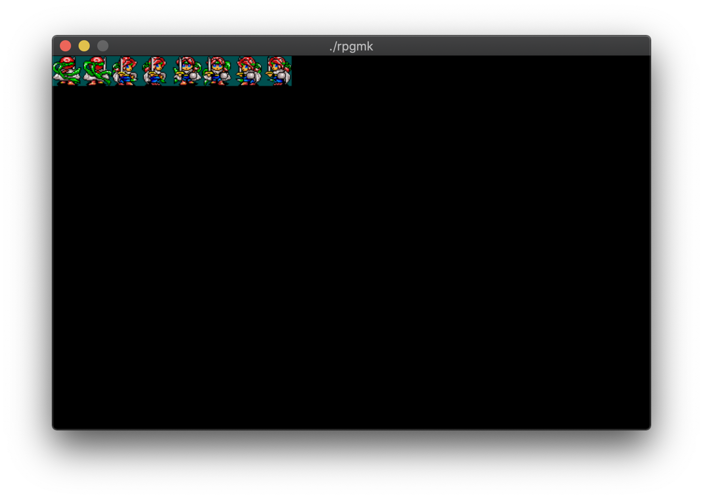
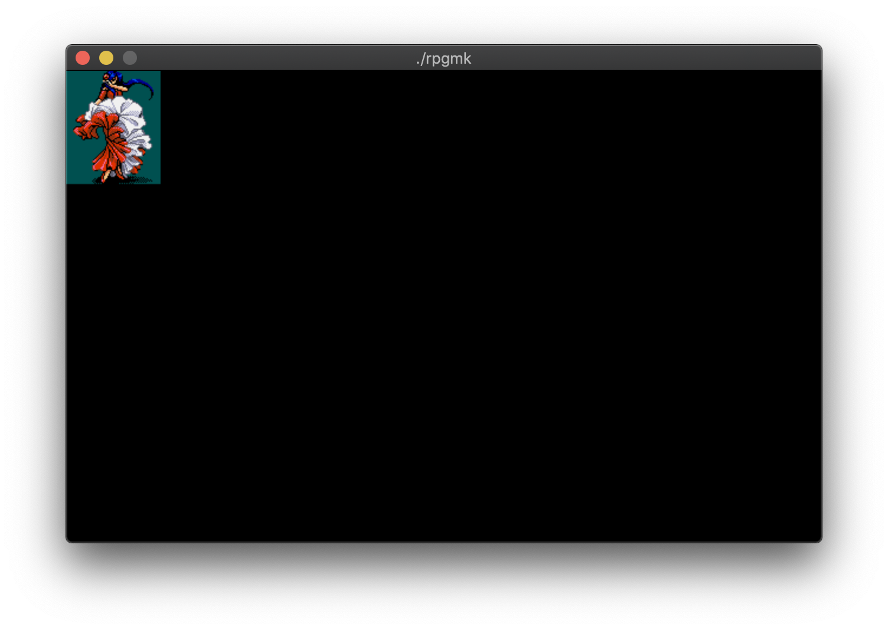
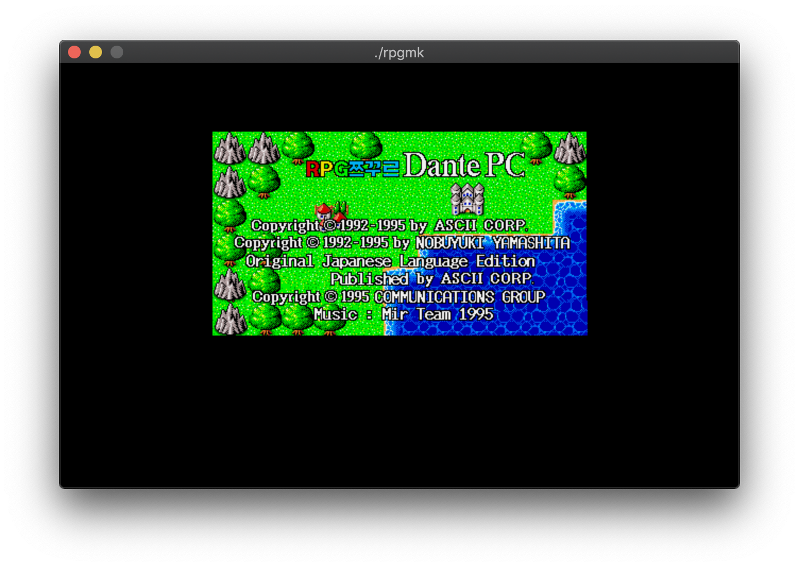
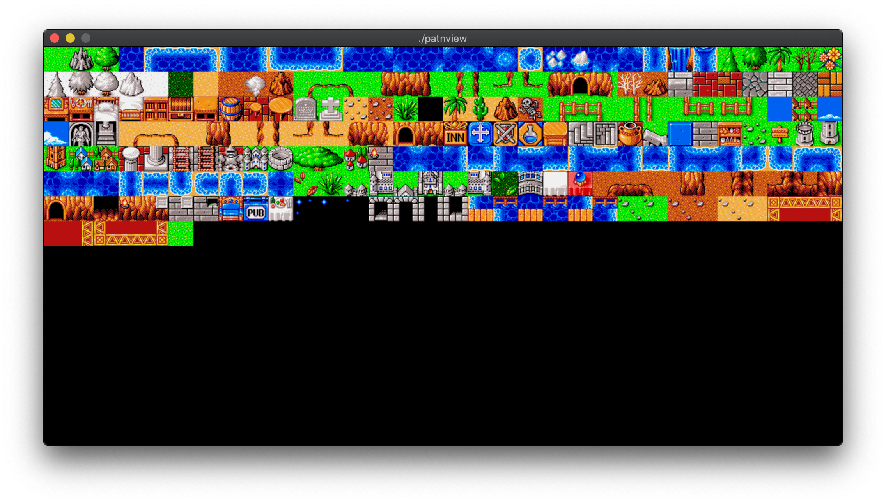

# rpgmk
RPG쯔꾸르 DANTE PC의 16컬러 이미지 데이터를 읽어 출력하는 프로그램

# 빌드
```sh
$ brew install sdl2
$ make
```

# 사용법
```sh
$ ./imageview CHR00.DAT PALET.DAT 32 32
$ ./imageview ENEMY00.DAT PALET2.DAT 80 96
$ ./imageview OPNTITLE.DAT OPNTITLE.RGB 640 400
$ ./patnview
```

# 스크린샷





# 비고: RPGMK의 이미지 파일 특징
~~RPGMK의 이미지 파일은 한 픽셀이 4비트를 차지하고 있는 비압축 형식의 포맷이다. 하지만 보안 때문인지, 다르 어떤 이유 때문인지는 모르지만, 데이터를 매우 복잡하게 꼬아놓았기 때문에, 분석하는데 매우 애를 먹었다.~~

~~먼저 가장 쉬운 ENEMY00.DAT 같은 경우를 보면, 64x80의 이미지 한 장이 들어 있는데, 세로로 4개의 점에 대한 데이터를 총 16조각 내어 저장한다. 세로로 4개이기 때문에 비트수는 총 16비트가 된다. 또한 이 16개의 비트가 4x4크기의 행렬이라고 했을 때, 그 행렬 그대로 저장하는 것이 아니라, 행렬을 전치행렬로 만들어서 저장한다.~~

~~따라서, (0001)같은 비트를 각각 쪼개어 세로로 배치시켜서 저장한다는 의미이다.~~

인 줄 알았는데, 조금 더 들여다보니 비트 조합의 align length가 (file size / 4) 인 단순한 형태였다.

즉, 32x32인 캐릭터의 파일 크기는 512인데 512 / 4는 128이 되는데, 한번에 128 바이트씩 4번 읽어서 한번에 이미지의 모든 픽셀값을 생성하는 원리이다. (32x32 이미지의 경우 픽셀수는 1024개인데, 1024개의 픽셀을 한 번에 
이는 https://github.com/gcjjyy/koei_viewer 에서 align length를 file size / 4로 사용하여 출력하면 동일한 이미지가 출력된다.
